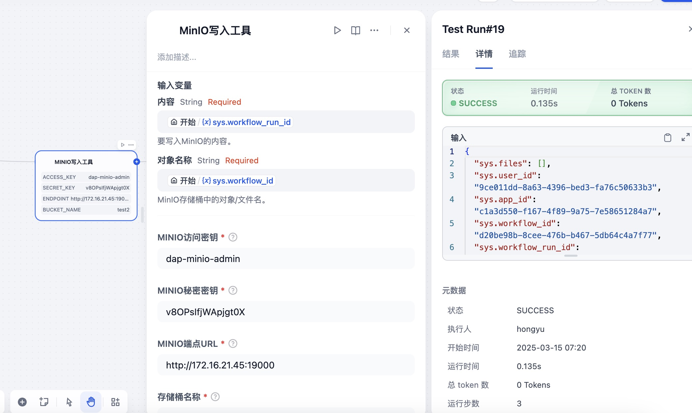

# Minio Plugin

**Author:** [aias00](https://github.com/aias00)
**Version:** 0.0.3
**Type:** tool

## Description

### MinioWriter Plugin

The MinioWriter Plugin allows users to write data into Minio.

### Features

- Write data into minio and returns standard output and standard error

### Parameters

| Parameter | Type | Required | Description |
|-----------|------|----------|-------------|
| access_key | string | Yes | access_key of the remote server |
| secret_key | string | Yes | secret_key of the remote server |
| endpoint | string | Yes | endpoint of the remote server |
| bucket_name | string | Yes | bucket name in minio |
| content | string | Yes | Content to write into minio |
| object_name | string | Yes | object name to write into minio |

### MinioReader Plugin

The MinioReader Plugin allows users to read data from Minio.

### Features

- Read data from minio and returns standard output and standard error

### Parameters

| Parameter | Type | Required | Description |
|-----------|------|----------|-------------|
| access_key | string | Yes | access_key of the remote server |
| secret_key | string | Yes | secret_key of the remote server |
| endpoint | string | Yes | endpoint of the remote server |
| bucket_name | string | Yes | bucket name in minio |
| object_name | string | Yes | object name to read from minio |

### MinioUploader Plugin

The MinioUploader Plugin allows users to upload local files to Minio.

### Features

- Upload local files to minio and returns upload status

### Parameters

| Parameter | Type | Required | Description |
|-----------|------|----------|-------------|
| access_key | string | Yes | access_key of the remote server |
| secret_key | string | Yes | secret_key of the remote server |
| endpoint | string | Yes | endpoint of the remote server |
| bucket_name | string | Yes | bucket name in minio |
| local_file_path | string | Yes | Local file path to upload |
| object_name | string | Yes | object name in minio bucket |

## Security Considerations

- Ensure you have permission to access the target server
- Sensitive information such as private keys and passwords should be kept secure
- Follow the principle of least privilege, granting only necessary execution permissions

## License

[MIT](./LICENSE)

